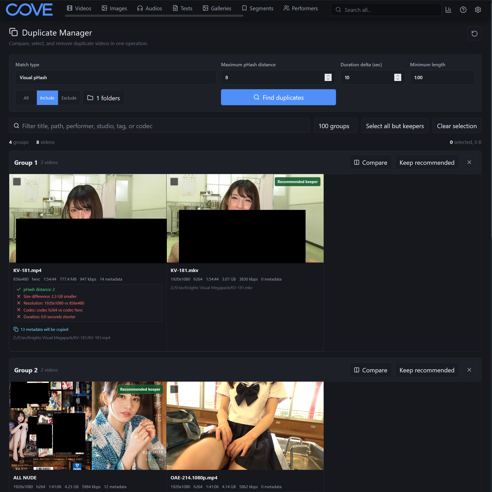
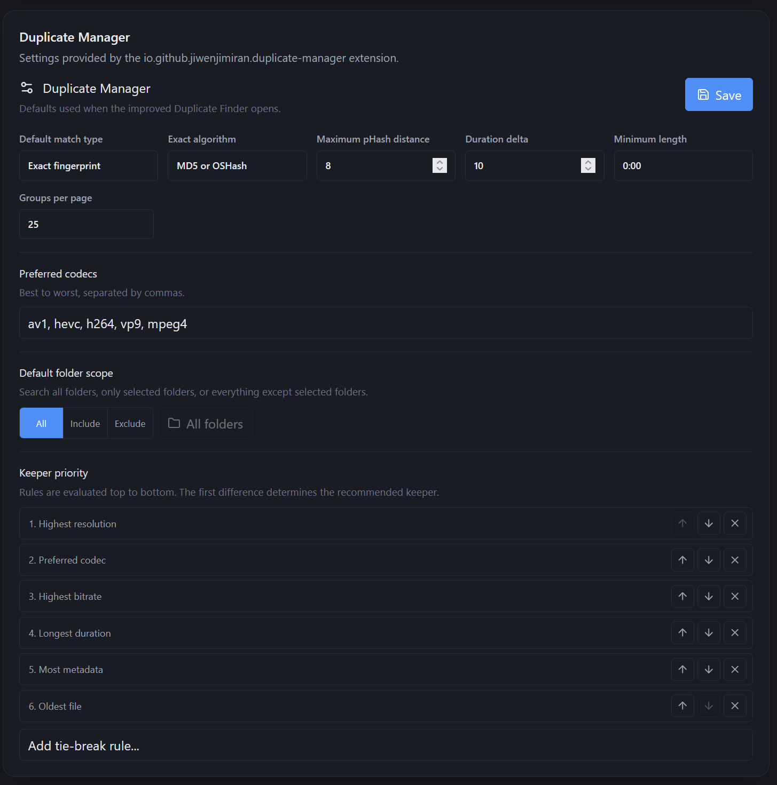
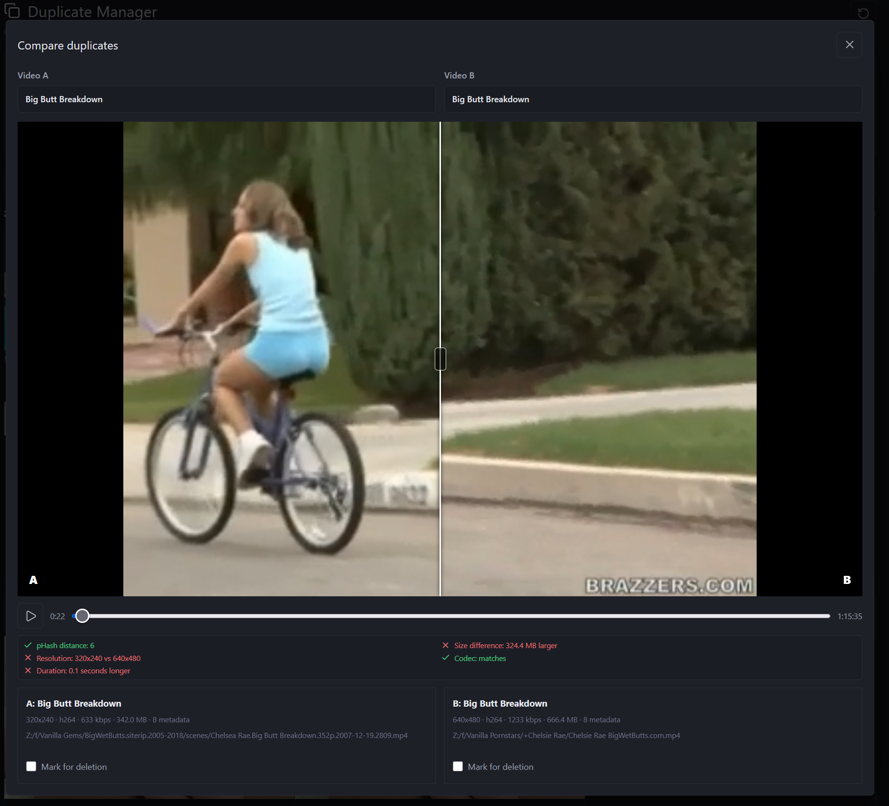

# Duplicate Manager for Cove

Duplicate Manager replaces Cove's built-in Duplicate Finder with a workflow designed for reviewing and deleting many duplicate videos at once.

## Screenshots

### Duplicate review



### Extension settings



### Side-by-side comparator



## Features

- Exact MD5/OSHash and configurable visual pHash matching
- Same-title and same-remote-ID matching compatible with Cove's built-in finder
- Shareable search URLs that restore controls, result-filter queries, and run the duplicate search after refresh
- All/include/exclude folder scope, text filtering, group pagination, and session-cached results
- Select-to-delete workflow with automatic "keep recommended" rules
- Configurable metadata, resolution, codec, bitrate, size, and age priorities
- Muted hover previews and synchronized Direct/FFmpeg A/B video comparison with a wipe slider
- One confirmation for bulk record, source-file, and generated-file deletion
- A safety check that requires at least one keeper in every affected group
- Saved metadata-transfer defaults, including checked-by-default missing-value copying and optional conflict overwriting
- Defaults under `Settings -> Extensions -> Installed -> Duplicate Manager`

The extension targets Cove `1.0.0` or newer. Matching and deletion use Cove's authenticated APIs, so normal Cove video and file permissions remain in effect.

## Build

Prerequisites: .NET 10 SDK and Node.js 20 or newer.

```powershell
cd .\frontend
npm install
npm test
npm run build
cd ..
dotnet build .\DuplicateManager.slnx -c Release -p:UseLocalCovePlugins=false
```

Create an installable ZIP:

```powershell
.\scripts\package.ps1
```

The package is written to `artifacts\io.github.jiwenjimiran.duplicate-manager-1.9.6.zip`.

## Upgrade from 1.6.0 or older

Version 1.7.0 changes the extension ID from `cove.community.ai.duplicate-manager` to
`io.github.jiwenjimiran.duplicate-manager`. Cove treats the new ID as a different extension.
Disable and uninstall the old extension before installing 1.7.0. For a manual installation,
stop Cove and remove the old `extensions\cove.community.ai.duplicate-manager` directory.
Do not leave both IDs installed because both packages override the Duplicate Finder page.

Settings stored under the old extension ID do not migrate and must be configured again after
installation. This does not affect Cove video metadata or source files.

## Install

### From a GitHub release

1. Open Cove and go to `Settings -> Extensions -> Installed`.
2. Choose **Install from URL**.
3. Paste the direct URL for `io.github.jiwenjimiran.duplicate-manager-1.9.6.zip` from the GitHub release.
4. Enable the extension if Cove does not enable it automatically, then reload Cove.
5. Open Cove's existing **Duplicate Finder**. The extension replaces that page.

### From a local build

1. Run `.\scripts\package.ps1`.
2. Locate the Cove instance data directory. Its `extensions` directory is the sibling of the instance's `data` directory.
3. Create `extensions\io.github.jiwenjimiran.duplicate-manager` and extract the ZIP contents directly into it. `extension.json` and `Cove.DuplicateManager.dll` must be at that directory's root.
4. Restart the Cove instance, then verify **Duplicate Manager** appears in `Settings -> Extensions -> Installed`.

## Safety

Checkboxes always mean **mark for deletion**. Automatic selection leaves one recommended keeper in each group, and the extension blocks any operation that would remove a whole group. The confirmation defaults to copying metadata to the keeper and deleting generated files while leaving source files on disk.

## License

MIT
