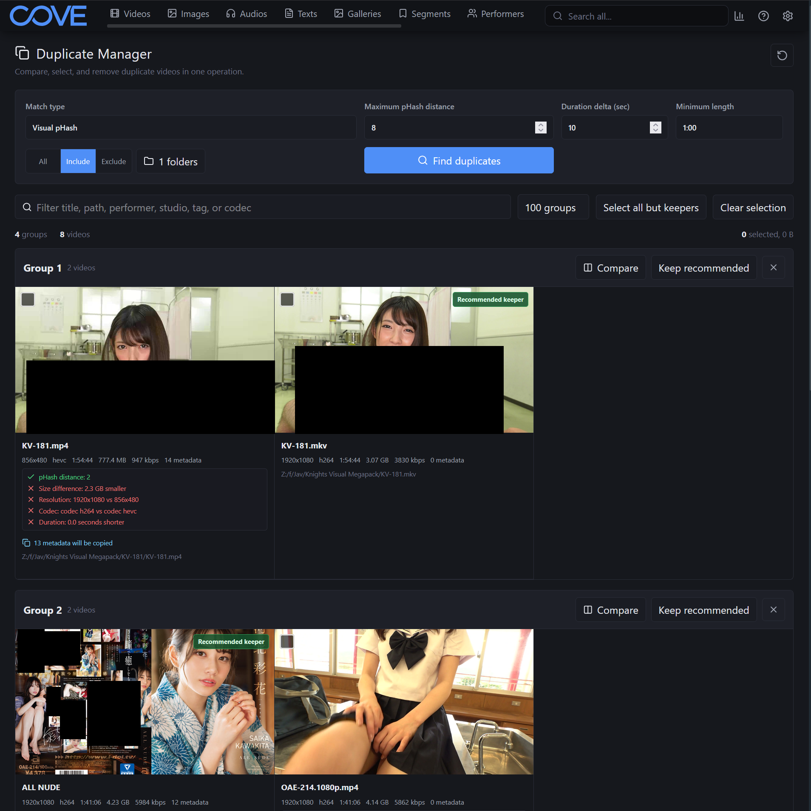
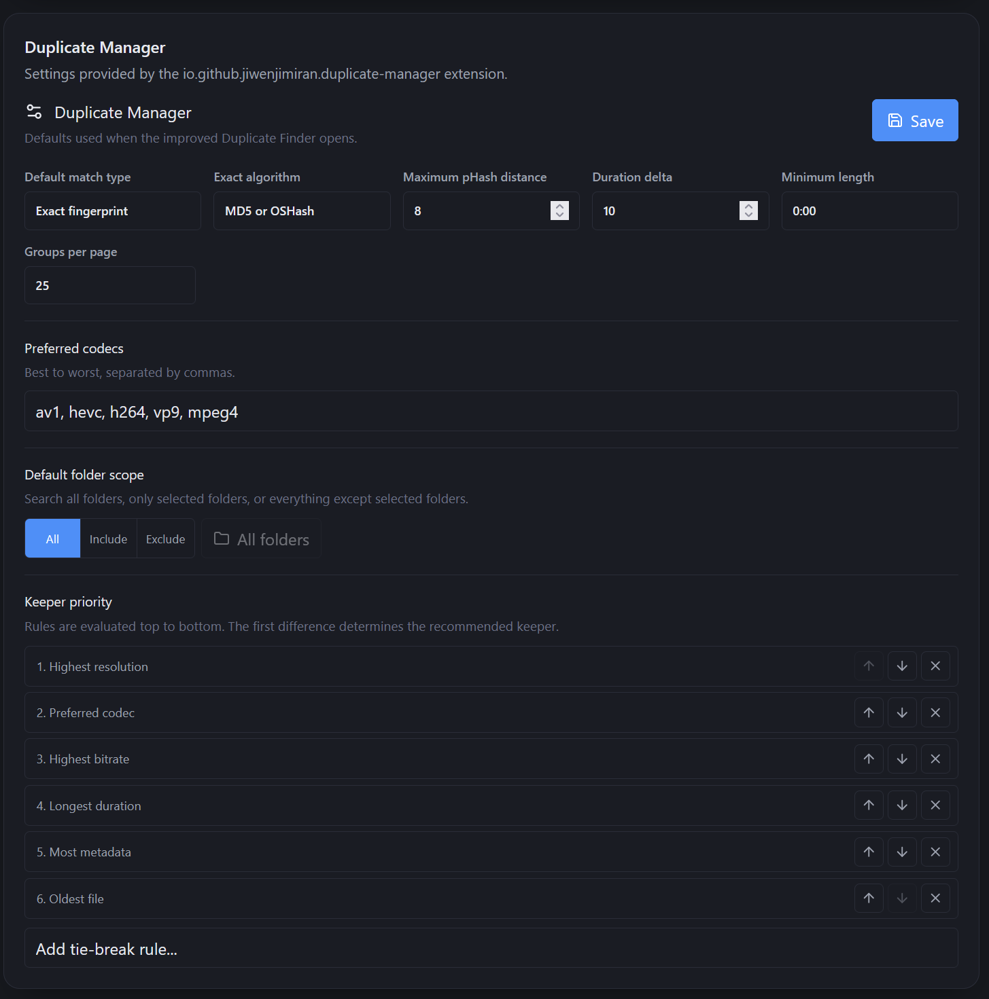
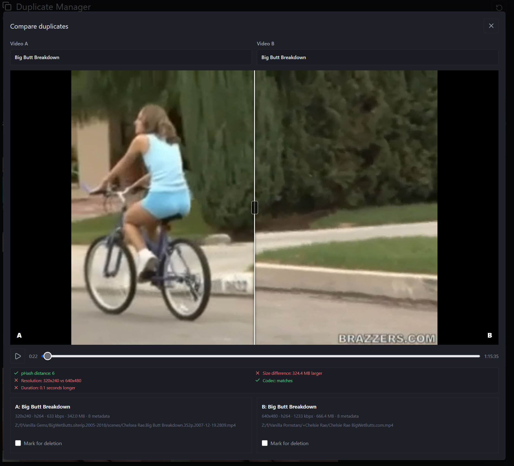

# Duplicate Manager for Cove

Duplicate Manager replaces Cove's built-in Duplicate Finder with a workflow designed for reviewing and deleting many duplicate videos at once.

## Screenshots

### Duplicate review



### Extension settings



### Side-by-side comparator



## Features

- Background duplicate searches without Cove's 100,000-candidate, 100,000-row, or 64 MiB admission limits
- Durable search results through Cove's new duplicate-search API, cancellation from the page or Jobs, and pending-search resume after refresh
- Core-owned video cleanup with keeper reservations, permission checks, metadata/provenance migration, and transactional file deletion
- Curated cover preservation: keep the keeper's saved cover, otherwise carry over a donor's saved cover; metadata overwriting never replaces it with a generated frame
- Exact MD5/OSHash and configurable visual pHash matching
- Same-title and same-remote-ID matching compatible with Cove's built-in finder
- Shareable search URLs that restore controls, result-filter queries, and run the duplicate search after refresh
- All/include/exclude folder scope, text filtering, group pagination, and session-cached results
- Select-to-delete workflow with automatic "keep recommended" rules
- Balanced codec-aware keeper recommendations with clear reasons, risk scoring, and an optional custom-rule mode
- Muted hover previews and synchronized Direct/FFmpeg A/B video comparison with a wipe slider
- Explicit records-only or permanent source-file cleanup in a Cove background job
- Server-owned metadata transfer and deletion that continue after navigating away from the extension page, with per-video partial-failure reporting
- Per-user affinity, rating, bookmark, and interaction migration before duplicate records are removed
- A separate review-only image deduper using stored exact pHashes, job-based metadata merging and permanent cleanup, and archive protection
- A safety check that requires at least one keeper in every affected group
- Saved metadata-transfer defaults, including checked-by-default missing-value copying and optional conflict overwriting
- Defaults under `Settings -> Extensions -> Installed -> Duplicate Manager`

Version 2.1.0 requires Cove `1.5.1` or newer with the duplicate review migrations applied. Older Cove versions should keep using 2.0.3. Starting a deletion job uses Cove's authenticated extension API, so normal Cove video and image permissions remain in effect; the queued work then runs on Cove's server.

## Build

Prerequisites: .NET 10 SDK, Node.js 20 or newer, and Cove v1.5.1 source for build contracts. The package script uses `artifacts/cove-v1.5.1` or an explicit `-CoveSourceRoot`.

```powershell
cd .\frontend
npm install
npm test
npm run build
cd ..
git clone --branch v1.5.1 --depth 1 https://github.com/yourcove/cove.git .\artifacts\cove-v1.5.1
dotnet build .\DuplicateManager.slnx -c Release -p:CoveSourceRoot="$PWD/artifacts/cove-v1.5.1"
```

Create an installable ZIP:

```powershell
.\scripts\package.ps1
```

The package is written to `artifacts\io.github.jiwenjimiran.duplicate-manager-2.1.0.zip`.

## Upgrade from 1.6.0 or older

Version 1.7.0 changes the extension ID from `cove.community.ai.duplicate-manager` to
`io.github.jiwenjimiran.duplicate-manager`. Cove treats the new ID as a different extension.
Disable and uninstall the old extension before installing 1.7.0. For a manual installation,
stop Cove and remove the old `extensions\cove.community.ai.duplicate-manager` directory.
Do not leave both IDs installed because both packages override the Duplicate Finder page.

Settings stored under the old extension ID do not migrate and must be configured again after
installation. This does not affect Cove video metadata or source files.

## Install

### From a GitHub release

1. Open Cove and go to `Settings -> Extensions -> Installed`.
2. Choose **Install from URL**.
3. Paste the direct URL for `io.github.jiwenjimiran.duplicate-manager-2.1.0.zip` from the GitHub release.
4. Enable the extension if Cove does not enable it automatically, then reload Cove.
5. Open Cove's existing **Duplicate Finder**. The extension replaces that page.

### From a local build

1. Run `.\scripts\package.ps1`.
2. Locate the Cove instance data directory. Its `extensions` directory is the sibling of the instance's `data` directory.
3. Create `extensions\io.github.jiwenjimiran.duplicate-manager` and extract the ZIP contents directly into it. `extension.json` and `Cove.DuplicateManager.dll` must be at that directory's root.
4. Restart the Cove instance, then verify **Duplicate Manager** appears in `Settings -> Extensions -> Installed`.

## Safety

Checkboxes always mean **mark for deletion**. Automatic selection leaves one recommended keeper in each group, and the extension blocks any operation that would remove a whole group. The confirmation defaults to copying metadata to the keeper and deleting generated files while leaving source files on disk.

Version 2.0.1 no longer creates or manages `.dedup-trash`. Existing folders created by 2.0.0 are left untouched so they can be reviewed manually.

## Search behavior and covers

Cove's built-in search limits live on the server. This extension starts its own worker at
`POST /api/ext/duplicate-manager/videos/duplicate-searches`, then uses Cove's
`GET /api/videos/duplicate-searches/{id}` and paginated groups endpoints. It preserves
Cove's folder scoping, ignored-pair handling, cancellation, durable result retention, and
bounded persisted groups. Search candidate counts, estimated memory, comparison counts,
and result-group counts do not have admission caps. Large searches can take longer and
use more actual server and browser memory. The metadata field/path validation remains.

Video cleanup uses Cove's core `resolve` endpoint with the reviewed keepers, so Cove owns
metadata merging, engagement/provenance transfer, child-video handling, keeper protection,
and the physical-deletion outbox. Missing-value transfer uses the core policy; conflict
overwriting prefers populated donor scalar values. Cover preference stays independent:
a saved keeper cover wins, or an explicitly saved donor cover fills a generated keeper.
The image review/cleanup workflow is unchanged.

## License

Original extension code is MIT. The adapted Cove search implementation in
`src/DuplicateManager/Search` is AGPL-3.0 (upstream commit
`e4f691eee80c57e3a01689661e7f409f559b5249`). The combined extension is distributed under
AGPL-3.0; its package includes the upstream license and attribution. Source is in this
repository. See `LICENSE` for the original code and `src/DuplicateManager/Search/COPYING`
for the incorporated implementation.
